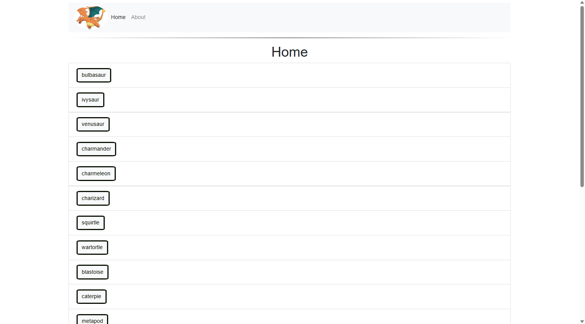
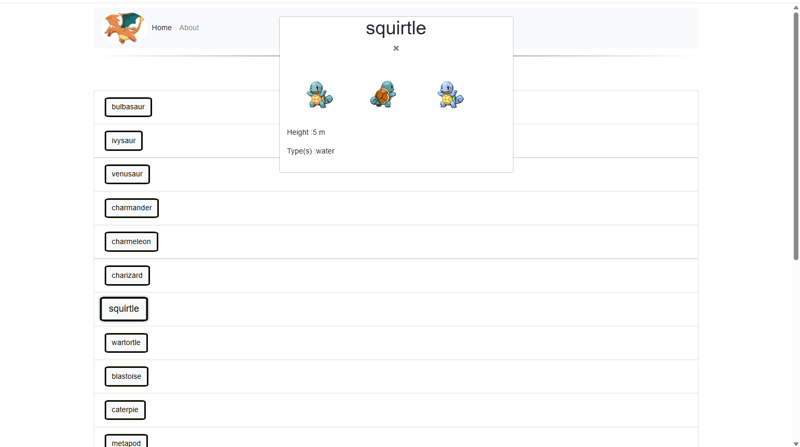

# simple-js-app

## Pokedex Application

A simple JavaScript application that serves as a Pokedex, providing information about various Pokémon. The app features a modern, responsive UI using Bootstrap, and fetches data from the public [Pokémon API](https://pokeapi.co/api/v2/pokemon/?limit=150).

**Built with jQuery and IIFE Architecture:**
This application is **specifically built using the jQuery library** for DOM manipulation and event handling. The entire functionality is implemented using an **IIFE (Immediately Invoked Function Expression)** pattern in the `scripts.js` file, which provides encapsulation and creates a clean module structure for the Pokémon repository.

Here is the Pokedex Application, hosted via gh-pages: [Pokedex](https://dwyertyrell.github.io/Pokedex/)

This project is designed to demonstrate JavaScript skills with jQuery integration, including DOM manipulation, event handling, and API integration using modular IIFE patterns. It is suitable for developers looking to enhance their understanding of jQuery-based client-side web development.

---

## Table of Contents
- [Features](#features)
- [Technologies Used](#technologies-used)
- [Getting Started](#getting-started)
- [Usage](#usage)
- [Screenshots](#screenshots)
- [Project Structure](#project-structure)
- [Credits](#credits)

---

## Features
- **Pokémon List:** Displays a list of the first 150 Pokémon fetched from the API.
- **Search Functionality:** Search for Pokémon by name or ID in real time.
- **Detailed Modal:** Click a Pokémon to view its details (name, image, type, abilities, height, weight, etc.) in a Bootstrap modal.
- **Responsive Design:** Adapts to different screen sizes for mobile and desktop.
- **Navigation Bar:** Simple Bootstrap navbar for easy navigation.
- **Accessibility:** Uses semantic HTML and ARIA attributes for better accessibility.
- **Code Quality:** Linted with ESLint and formatted with Prettier.

---

## Technologies Used
- **jQuery 3.5.1** - Primary JavaScript library for DOM manipulation and event handling
- **JavaScript (ES6)** - Core functionality implemented using IIFE (Immediately Invoked Function Expression)
- HTML5
- CSS3
- [Bootstrap 4.3.1](https://getbootstrap.com/) - UI framework and responsive design
- [Pokémon API](https://pokeapi.co/) - RESTful API for Pokémon data
- ESLint - Code linting and quality assurance
- Prettier - Code formatting

---

## Getting Started

1. **Clone the repository:**
   ```sh
   git clone <repo-url>
   cd simple-js-app
   ```
2. **Install dependencies:**
   ```sh
   npm install
   ```
3. **Run the app:**
   Open `index.html` in your browser or run on live server via your editor

---

## Usage
- Use the search bar to filter Pokémon by name or ID.
- Click on a Pokémon to open a modal with detailed information.
- The app is fully responsive and works on mobile devices.

---

## Screenshots

_Add screenshots of the client-side UI below. For example:_

| Pokémon List | Pokémon Modal |
|--------------|--------------|
|  |   
 

---

## Project Structure
```
.
├── css/
│   └── styles.css
├── img/
│   ├── logo_img.png
│   ├── pokemon-favicon-32x32.png
│   └── ...
├── js/
│   ├── fetch.umd.js
│   └── scripts.js          ←  MAIN FUNCTIONALITY: jQuery + IIFE implementation
├── index.html
├── package.json
├── eslint.config.mjs
└── README.md
```

### Key File: `js/scripts.js`
The **core application logic** is contained in `scripts.js`, which shows:
- **IIFE Pattern**: The entire `pokemonRepository` is wrapped in an Immediately Invoked Function Expression for encapsulation
- **jQuery Integration**: All DOM manipulation and event handling uses jQuery syntax (`$`)
- **Module Pattern**: separation of public and private methods within the IIFE
- **API Integration**: Fetch operations and data management for Pokémon information

---

## Credits
<!-- - [PokéAPI](https://pokeapi.co/) for Pokémon data -->
- Bootstrap for UI components
---

## License
This project is licensed under the MIT License.